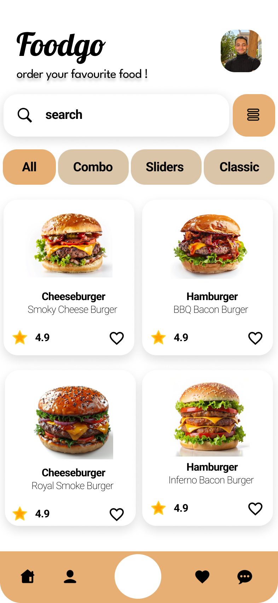
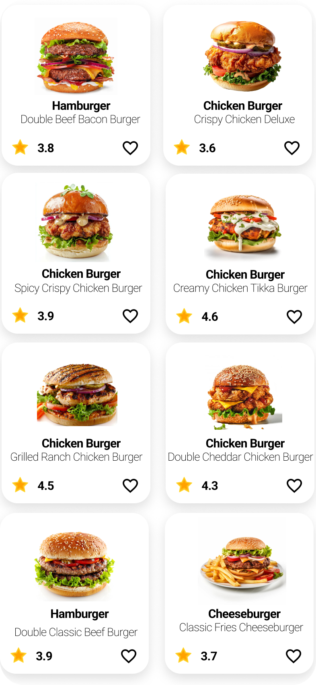
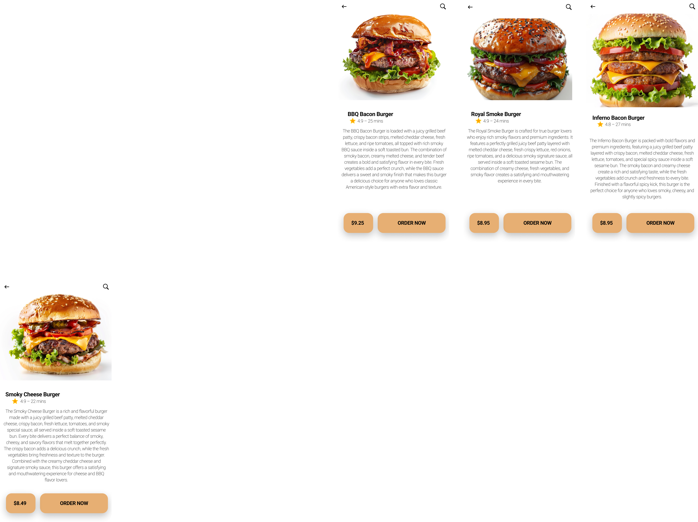
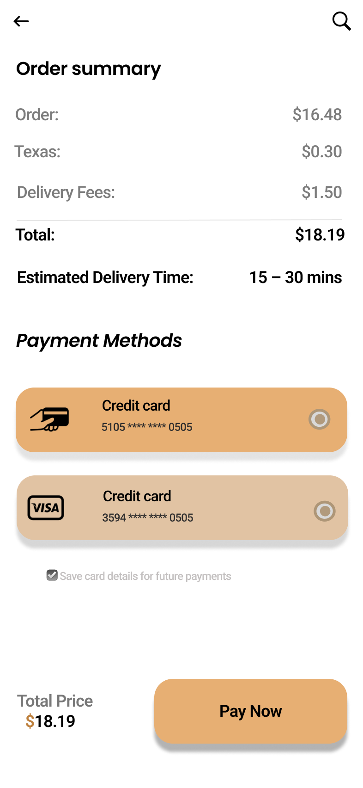
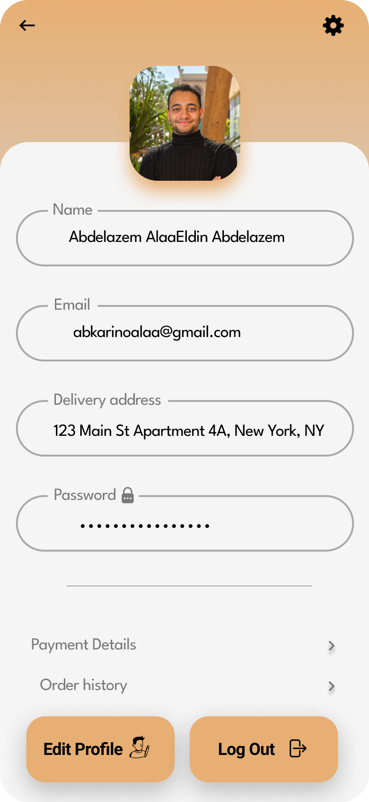

# FoodGo - Food Delivery UI/UX

## Overview
FoodGo is a modern food delivery mobile application designed using Figma.

## Features
- Modern mobile interface
- Product browsing
- Food ordering flow
- Checkout process
- Customer support chat
- User profile system

## Tools Used
- Figma

## Project Structure
- assets/
- screens/
- prototype/
- docs/

## Prototype
[View Prototype](https://www.figma.com/design/GX5zTkzU4iEhRO8leGsNhl/FoodGo?m=auto&t=APA4DOX3Z8cE6Flr-6)

## screen shots

