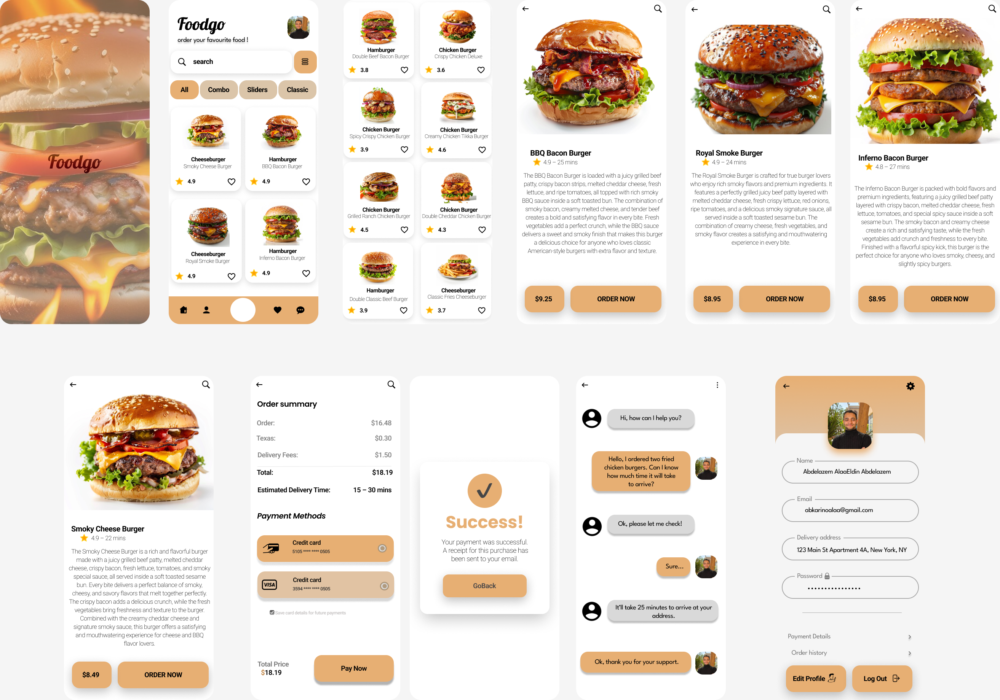

# 🍔 FoodGo - Food Delivery UI/UX

  

  Modern Food Delivery Mobile Application Designed in Figma

---

## 📌 Overview

FoodGo is a modern food delivery mobile application focused on creating a smooth and intuitive ordering experience with a clean and user-friendly interface.

The project was designed entirely in Figma with attention to:
- Visual hierarchy
- User flow
- Mobile responsiveness
- Simplicity and usability

---

## 🚀 Features

- Modern mobile interface
- Fast food browsing
- Interactive product details
- Smooth checkout process
- Customer support chat
- User profile management
- Clean and minimal UI

---

## 🎯 Design Goals

- Create a simple and intuitive user experience
- Improve food browsing flow
- Build a clean mobile-first interface
- Maintain visual consistency across screens
- Focus on accessibility and readability

---

## 🛠️ Tools Used

- Figma
- Auto Layout
- Prototype Interactions

---

## 📱 Screenshots

  

---

## 🔗 Prototype

[View Interactive Prototype](https://www.figma.com/design/GX5zTkzU4iEhRO8leGsNhI/FoodGo?m=auto&t=APA4DOX3Z8cE6FIr-6)

---

## 👨‍🎨 Designer

**Abdelazem Alaa Eldin**

UI/UX Designer passionate about creating modern and user-friendly digital experiences.

